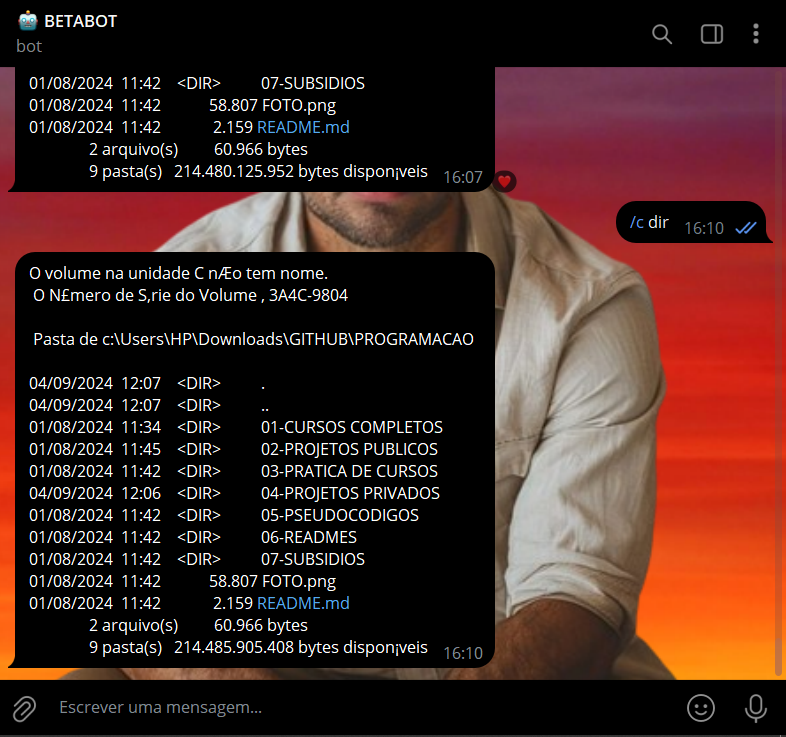

# COMANDOS DO SISTEMA
🌐BOT DO TELEGRAM QUE TE AJUDA A GERENCIAR SEU PC VIA COMANDOS.

 <br>

## DESCRIÇÃO:
É um bot de Telegram que executa comandos no sistema operacional quando acionado por um administrador. Aqui está uma breve descrição do que o bot faz:

1. **Inicia o Bot**: Quando você executa o código, ele inicia o bot com o token fornecido.

2. **Verifica Administradores**: Ele verifica se o ID do remetente da mensagem (usuário) corresponde a um ID de administrador especificado na variável `ADMINS`. Se o usuário não for um administrador, ele envia uma mensagem informando que não está autorizado.

3. **Comando /start**: Quando alguém envia o comando `/start`, o bot envia uma mensagem de boas-vindas.

4. **Comando /c**: Quando um administrador envia o comando `/c`, seguido por um comando, o bot executa esse comando no sistema operacional. Ele usa o módulo `subprocess.run` para executar o comando e capturar a saída padrão (stdout) e erros (stderr).

5. **Resposta aos Comandos**: O bot envia a saída do comando de volta ao chat do Telegram. Isso inclui qualquer saída padrão gerada pelo comando, bem como mensagens de erro, se houver.

## ATENÇÃO:
Lembre-se de que permitir que um bot execute comandos no sistema operacional pode ser arriscado, especialmente se ele for usado em chats públicos ou comandos não verificados. Certifique-se de compartilhar comandos somente com pessoas confiáveis e administração cuidadosa para evitar possíveis problemas de segurança.

Certifique-se de que as configurações de segurança do seu sistema permitam a execução de comandos via `subprocess.run`.

## COMO USAR?
1. **Coloque o Token:**
   - Antes de executar o bot, é necessário substituir o token do seu bot, o qual pode ser obtido por meio do [@BotFather](https://t.me/BotFather) e seu [ID DE ADM](https://github.com/VILHALVA/BUSCADOR-DE-ID) no arquivo `DADOS.py`. 

2. **Instalando as dependências:**
   - Certifique-se de instalar todas as dependências necessárias. No terminal, execute o seguinte comando para instalar as dependências listadas no arquivo `requirements.txt` em `CODIGO`:
   ```bash
   pip install -r requirements.txt
   ```

3. **Inicie o Bot:**
   - Execute o bot do Telegram em Python iniciando-o com o seguinte comando:
   ```bash
   python CODIGO.py
   ```
   - Inicie o bot enviando o comando `/start`. 

4. **Receber Saudação Inicial:**
   - O bot enviará uma mensagem de boas-vindas, fornecendo instruções sobre como utilizar seus recursos.

## EXEMPLOS DE COMANDOS:
### PARA WINDOWS:
1. **Listar arquivos no diretório atual**:
   - Comando: `/c dir`
   - Função: Exibe a lista de arquivos e pastas no diretório atual (equivalente ao `ls` no Linux).

2. **Mostrar a versão do sistema operacional**:
   - Comando: `/c ver`
   - Função: Exibe a versão do Windows.

3. **Verificar a conectividade (ping)**:
   - Comando: `/c ping www.google.com`
   - Função: Envia pacotes de teste para o Google para verificar a conectividade com a internet.

4. **Ver processos em execução**:
   - Comando: `/c tasklist`
   - Função: Exibe a lista de processos em execução no sistema.

5. **Limpar o terminal**:
   - Comando: `/c cls`
   - Função: Limpa a tela do terminal (equivalente ao `clear` no Linux).

### PARA LINUX:
1. **Listar arquivos no diretório atual**:
   - Comando: `/c ls`
   - Função: Exibe a lista de arquivos e pastas no diretório atual (equivalente ao `dir` no Windows).

2. **Mostrar a versão do sistema operacional**:
   - Comando: `/c uname -a`
   - Função: Exibe informações sobre o sistema operacional Linux.

3. **Verificar a conectividade (ping)**:
   - Comando: `/c ping www.google.com`
   - Função: Envia pacotes de teste para o Google para verificar a conectividade com a internet (similar ao Windows).

4. **Ver processos em execução**:
   - Comando: `/c ps aux`
   - Função: Exibe a lista de processos em execução no sistema.

5. **Limpar o terminal**:
   - Comando: `/c clear`
   - Função: Limpa a tela do terminal (equivalente ao `cls` no Windows).

## NÃO SABE?
- Entendemos que para manipular arquivos em muitas linguagens e tecnologias relacionadas, é necessário possuir conhecimento nessas áreas. Para auxiliar nesse aprendizado, oferecemos alguns subsidios:
* [CURSO DE TELEBOT](https://github.com/VILHALVA/CURSO-DE-TELEBOT)
* [CURSO DE PYTHON](https://github.com/VILHALVA/CURSO-DE-PYTHON)
* [CONFIRA MAIS CURSOS](https://github.com/VILHALVA?tab=repositories&q=+topic:CURSO)

## CREDITOS:
- [PROJETO CRIADO PELO VILHALVA](https://github.com/VILHALVA)

